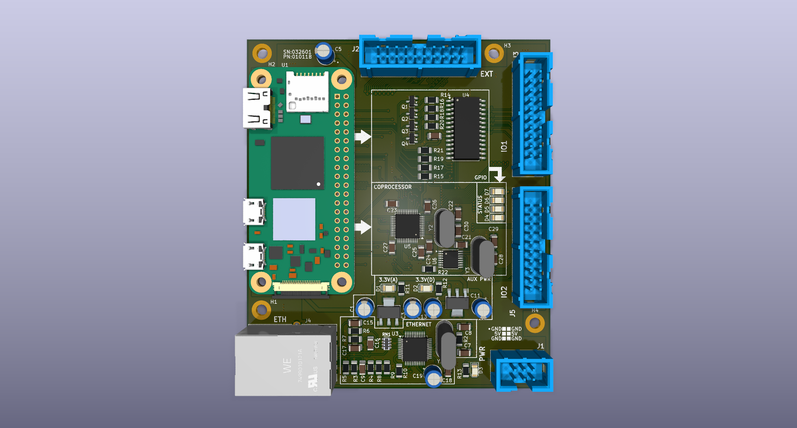

# EtherKraken

A RP3A0 SiP based controller board with 38 programmable IOs, 2MB of flash, SPI, I²C, UART and 100Base-T connectivity
for embedded- and automation-applications.



### Building libkraken

In order to build the `libkraken` hardware abstraction layer library,  
a computer or VM with a Debian/Ubuntu based Linux distribution is recommended.

The following dependencies are required:

```
build-essential gcc-14 g++-14 make cmake
```

When cross-compiling on a `x86_64` host, also install the following:

```
aarch64-linux-gnu-gcc-14 aarch64-linux-gnu-g++-14
```

When you have all dependencies installed, simply invoke `build.sh` in the `libkraken` directory.

### Building kraken-core

`kraken-core` is the high level Kotlin/Native wrapper around the `libkraken` HAL.  
In order to build it, you only need [a JDK](https://www.azul.com/downloads/?package=jdk#zulu) on an Ubuntu/Debian based Linux distribution.

Simply run the following command in the root of the repository:

```shell
./gradlew build
```